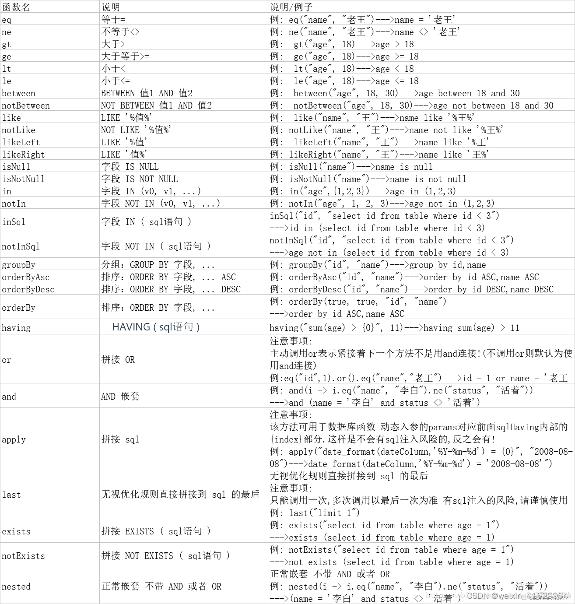

# Short-Url 短链接生产器
## 反馈

任何有关于 **Short-Url** 工具包的相关疑问，出现的Bug, 错误等都可以联系邮箱：3161880795@qq.com 进行及时的交流与反馈。


## 关于
- 关于作者：作者是一个潜心修炼的 Java 学生，路漫漫其修远兮，吾将上下而求索。
- 作者邮箱：3161880795@qq.com
- Github地址：https://www.github.com/hk-hub/

## 待办：

- 添加：base64 的压缩，二维码的压缩
- 添加：302 重定向日志
- 添加：短链接信息统计
- 添加：用户偏好信息记录
- 完善：压缩算法更新补充
- 完善：发号器算法重构
- 完善：雪花算法优化
- 构建：Spring Boot Starter 构建
- 构建：发布Maven 仓库依赖


## 开发日志


- [ ] 2022-6-13 完成短链接生成访问的基本逻辑链路


### 持续集成/部署
- docker: 云原生环境下的项目部署
- jenkins: 配合服务器，github 进行持续开发
- github:
	- master 分支：最新代码提交到 master分支
	- dev 分支：开发过程统一提交到dev 分支
	- pro 分支：生产分支在进行系统的测试后上线到该分支，可以用于实际生产尝试
	- front 分支：前端工程提交到front 分支

### 软件开发过程模型
- 螺旋模型：测试与开发并行，阶段性的功能测试，模块化的集成测试


### 软件开发文档
- 需求文档分析
- 科学分析文档
- 概要设计文档
- 系统设计文档
- 系统测试文档
- 项目评审文档


# 领域模型设计
## 实体设计

**tb_long_url**:
```sql
CREATE TABLE `tb_long_url` (
  `id` varchar(64) NOT NULL COMMENT '长链接ID号',
  `url` varchar(1024) NOT NULL COMMENT '完整的URL链接，可以是普通http 请求url ,qrcode ，base64等',
  `uri` varchar(256) DEFAULT NULL COMMENT 'URI 统一资源标识符,url 最后一部分',
  `type` int DEFAULT '0' COMMENT 'url 资源类型: request 请求类型，二维码类型，base64类型',
  `protocol` varchar(32) DEFAULT NULL COMMENT '调用协议类型:HHTP,RPC',
  `caller_version` varchar(16) DEFAULT NULL COMMENT '远端调用，长链接的请求协议版本',
  `host` varchar(64) DEFAULT NULL COMMENT '长链接主机地址',
  `port` int DEFAULT NULL COMMENT '长链接的端口',
  `method` varchar(16) DEFAULT NULL COMMENT '长链接的请求端口',
  `params` varchar(1024) DEFAULT NULL COMMENT 'url 链接地址请求参数，? 分割',
  `visible` tinyint(1) DEFAULT '1' COMMENT '是否可见1可见，0不可见',
  `version` int DEFAULT NULL COMMENT '乐观锁',
  `deleted` tinyint(1) DEFAULT '0' COMMENT '逻辑删除:0未删除，1已删除\n',
  `create_time` datetime DEFAULT NULL COMMENT '创建时间',
  `update_time` datetime DEFAULT NULL COMMENT '更新时间',
  PRIMARY KEY (`id`)
) ENGINE=InnoDB DEFAULT CHARSET=utf8 COMMENT='长链接'
```

**tb_short_url**:
```sql
CREATE TABLE `tb_short_url` (
  `id` varchar(64) NOT NULL COMMENT '短链接ID号',
  `short_url` varchar(32) NOT NULL COMMENT '生成后的短链接',
  `type` int DEFAULT NULL COMMENT '短链接类型: http 请求链接，二维码，base64',
  `no` mediumtext COMMENT '编号:目前作用未知',
  `visible` tinyint(1) DEFAULT '1' COMMENT '可见性:1可见，0不可见',
  `create_time` datetime DEFAULT NULL COMMENT '创建时间',
  `expiration_time` datetime DEFAULT NULL COMMENT '过期时间：表示短链接从创建经过到使用到消亡的时间，是指失效的时间：\nexpiration_time=create_time+有效时间',
  `version` int DEFAULT NULL COMMENT '乐观锁',
  `update_time` datetime DEFAULT NULL COMMENT '跟新时间\n',
  `deleted` tinyint(1) DEFAULT '0' COMMENT '是否可见：1可见，0不可见',
  PRIMARY KEY (`id`)
) ENGINE=InnoDB DEFAULT CHARSET=utf8 COMMENT='短链接表'
```

**tb_visit_log**:
```sql
CREATE TABLE `tb_visit_log` (
  `id` varchar(32) NOT NULL COMMENT 'ID号',
  `short_url_id` varchar(32) DEFAULT NULL COMMENT '短链接ID',
  `long_url_id` varchar(32) DEFAULT NULL COMMENT '长链接ID',
  `visitor_ip` varchar(64) DEFAULT NULL COMMENT '访问者的IP地址',
  `request_host` varchar(64) DEFAULT NULL COMMENT '请求的域名',
  `target_host` varchar(64) DEFAULT NULL COMMENT '长链接(目标链接)域名',
  `equipment` varchar(64) DEFAULT NULL COMMENT '访问设备:操作系统类型，浏览器类型',
  `visitor_area` varchar(125) DEFAULT NULL COMMENT '访问地区：国家，省份，市级，区级',
  `method` varchar(8) DEFAULT NULL COMMENT '访问方法',
  `create_time` datetime DEFAULT NULL COMMENT '访问时间',
  `update_time` datetime DEFAULT NULL COMMENT '跟新时间',
  `deleted` tinyint(1) DEFAULT '0' COMMENT '逻辑删除：1删除，0未删除',
  PRIMARY KEY (`id`)
) ENGINE=InnoDB DEFAULT CHARSET=utf8 COMMENT='短链接访问日志'
```

**tb_app_user**:
```sql
CREATE TABLE `tb_app_user` (
  `id` varchar(32) NOT NULL COMMENT '用户ID号，临时用户，不登录用户没有ID，只有注册用户才有ID',
  `username` varchar(32) DEFAULT NULL COMMENT '用户名',
  `password` varchar(16) DEFAULT NULL COMMENT '密码',
  `email` varchar(32) DEFAULT NULL COMMENT '注册邮箱：日后进行数据报表发送',
  `vip` tinyint(1) DEFAULT '0' COMMENT '是否为会员',
  `secret_key` varchar(64) DEFAULT NULL COMMENT '密钥，用户哪来获取报表数据信息的验证',
  `visible` tinyint(1) DEFAULT '1' COMMENT '可见性',
  `create_time` datetime DEFAULT NULL COMMENT '创建时间',
  `update_time` datetime DEFAULT NULL COMMENT '更新时间',
  `deleted` tinyint(1) DEFAULT '0' COMMENT '逻辑删除',
  PRIMARY KEY (`id`)
) ENGINE=InnoDB DEFAULT CHARSET=utf8 COMMENT='用户User，Sass对外提供接口的使用用户'
```


**tb_url_map**:
```sql
CREATE TABLE `tb_url_map` (
  `short_id` varchar(64) DEFAULT NULL COMMENT '短链接ID号',
  `short_url` varchar(32) DEFAULT NULL COMMENT '短链接url',
  `long_id` varchar(64) DEFAULT NULL COMMENT '长链接ID',
  `long_url` varchar(1024) DEFAULT NULL COMMENT '长链接url',
  `long_md` varchar(64) DEFAULT NULL COMMENT '长链接的MD5值',
  `visible` tinyint(1) DEFAULT '1' COMMENT '映射关系是否可见',
  `create_time` datetime DEFAULT NULL COMMENT '映射关系创建时间',
  `expiration_time` datetime DEFAULT NULL COMMENT '映射关系失效时间=创建时间+有效时长',
  `version` int DEFAULT NULL COMMENT '乐观锁',
  `update_time` datetime DEFAULT NULL COMMENT '更新时间',
  `deleted` tinyint(1) DEFAULT '0' COMMENT '逻辑删除:1删除，0未删除'
) ENGINE=InnoDB DEFAULT CHARSET=utf8 COMMENT='长链接和短链接的映射关系'
```

**tb_anonymous_user**:
```sql
CREATE TABLE `tb_anonymous_user` (
  `secret_key` varchar(64) NOT NULL COMMENT '密钥',
  `short_url` varchar(64) DEFAULT NULL COMMENT '短链接',
  `long_url` varchar(1024) DEFAULT NULL COMMENT '长链接，可能带有参数',
  `create_time` datetime DEFAULT NULL COMMENT '匿名用户创建时间',
  `update_time` datetime DEFAULT NULL COMMENT '更新时间',
  `deleted` tinyint(1) DEFAULT '0' COMMENT '逻辑删除'
) ENGINE=InnoDB DEFAULT CHARSET=utf8 COMMENT='匿名用户，临时用户'
```

## 索引设计
```sql
# 匿名用户索引
create index idx_au_secret_key on tb_anonymous_user(secret_key);

# 联合索引，long_url 使用前缀索引
select
	count(distinct long_url)/count(*)as a,
	COUNT(DISTINCT left(long_url,100)) as b,
	COUNT(DISTINCT left(long_url,110)) as c
from tb_anonymous_user;
# 创建联合索引
create index idx_au_ssl on tb_anonymous_user(secret_key, short_url, long_url(16));


# app_user
# 用户名密码联合索引
create index idx_apu_uname_passwd on tb_app_user(username,password);
# 邮箱
create index idx_api_email on tb_app_user(email);


# long_url
# 前缀索引
create index idx_lurl_url_param on tb_long_url(url(16));

# short_url
create index idx_surl_url_type on tb_short_url(short_url,type);
create index idx_sutl_url_exptime on tb_short_url(short_url,expiration_time);

# tb_url_map
# 建立联合主键
alter table tb_url_map add constraint primary key (short_id,long_id);
# 建立索引
create index idx_um_slurl on tb_url_map(short_url,long_url(16));

# visit_log
create index idx_vl_sid_lid on tb_visit_log(short_url_id,long_url_id);
```


# 系统测试
## 核心算法测试
### 分布式ID算法测试
| 元素总数 | 短链接长度 | 切割策略 | set集合元素个数 | 冲突元素个数 | 冲突率 |
| --- | --- | --- | --- | --- | --- |
| 100 | 12 | 均衡 | 100 | 0 | 0.0 |
| 1000 | 12 | 均衡 | 1000 | 0 | 0.0 |
| 10000 | 12 | 均衡 | 10000 | 0 | 0.005 |
| 1000000 | 12 | 均衡 | 225682 | 774278 | 0.8532 |
| 10000 | 12 | 反转 | 10000 | 0 | 0.0 |
| 100000 | 12 | 反转 | 100000 | 0 | 0.0 |
| 1000000 | 12 | 反转 | 697070 | 302930 | 0.30293 |


> 表格说明：
> 	表格进行的是不连续，无规律时间模拟产生的短链接的冲突率，可以拟合实际环境下的测试。
>> 	切割策略：均衡：头身尾平均切割位数平分
>>  		 反转：将生产后的id 反转切割指定长度，去除高位 
>


### 随机字符串算法测试
| 元素总数 | 短链接长度 | 随机策略 | set集合元素个数 | 冲突元素个数 | 冲突率 |
| --- | --- | --- | --- | --- | --- |
| 100 | 6 | shuffle | 100 | 0 | 0.0 |
| 1000 | 6 | shuffle | 1000 | 0 | 0.0 |
| 10000 | 6 | shuffle | 10000 | 0 | 0.0 |
| 100000 | 6 | shuffle | 100000 | 0 | 0.0 |
| 1000000 | 6 | shuffle | 999991 | 9 | 0.0000009 |
| 1000000 | 12 | shuffle | 1000000 | 0 | 0.0 |


> 表格说明：
> 	表格进行的是不连续，无规律时间模拟产生的短链接的冲突率，可以拟合实际环境下的测试。
>> 	切割策略：shuffle：先对有序字符串池进行扰乱处理，防止出现连续字符串


### 字符串压缩算法测试
| 元素总数 | 短链接长度 | 随机策略 | set集合元素个数 | 压缩后元素个数 | 压缩率 |
| --- | --- | --- | --- | --- | --- |
| 917 | 29 | 路径压缩 | 18 | 29 | 0.9683751363140676 |
| 60 | 24 | 路径压缩 | 17 | 24 | 0.6 |


> 表格说明：
> 	测试环境：测试数据为分布较为均匀的长链接URL 
>> 	压缩策略：路径压缩：路径压缩，分治计算，取模拼接
>>		 	zlib 压缩：字节数据的压缩


### 发号器算法测试
| 元素总数 | 时长(秒) | 
| --- | --- |
| 1000 | 0.01 |
| 10000 | 0.428 |
| 100000 | 1.061 |


> 表格说明：
> 	测试环境：根据默认环境测试：begin_id=10000,remainder=10000, step=10000,delta=1
>> 	 生成完成后，再随机位置，添加随机字符保障安全性


## 引用
[函数式接口](https://blog.csdn.net/qq_46653783/article/details/115033226)



## 配置
- 私钥：hk_hub_short_url


## 开始进行服务器持续集成持续部署
## 宝塔搭建配置
> 外网面板地址: http://42.193.55.146:8888/58d2485b
内网面板地址: http://10.0.0.12:8888/58d2485b
username: t1puwuye
password: 02be18d0
If you cannot access the panel,
release the following panel port [8888] in the security group
若无法访问面板，请检查防火墙/安全组是否有放行面板[8888]端口
> 


